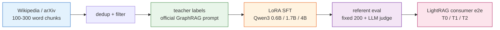

# kg-triplet-sft

**English** | [中文](README.zh-CN.md)


Qwen3 knowledge-graph extraction: data construction → LoRA SFT → referent-level
evaluation → graph-RAG consumer validation. LoRA fine-tuning of Qwen3
(0.6B / 1.7B / 4B) to extract `{entities, relationships}` from open text in the
[Microsoft GraphRAG](https://github.com/microsoft/graphrag) knowledge-model
format, plus a referent-level evaluation harness and a
[LightRAG](https://github.com/HKUDS/LightRAG) consumer-impact study.

## Models

LoRA adapters on Hugging Face (canonical masked recipe):
[Qwen3-0.6B](https://huggingface.co/Alextgt/qwen3-0.6b-kg-extraction) ·
[Qwen3-1.7B](https://huggingface.co/Alextgt/qwen3-1.7b-kg-extraction) ·
[Qwen3-4B](https://huggingface.co/Alextgt/qwen3-4b-kg-extraction) —
[collection](https://huggingface.co/collections/Alextgt/kg-triplet-sft-6aa648ecebcd524f7b55a8b7).

## Results at a glance

| Stage | Result |
|---|---|
| Corpus | 3,349 labeled passages (2,575 train / 75 val / 700 test), English Wikipedia 60% + arXiv 40%, sentence-boundary chunks (100–300 words). |
| Teacher | Official Microsoft GraphRAG extraction prompt (MIT) via `qwen3-flash`. |
| Referent eval | Two-tier matching (normalized-exact + thinking LLM judge); fixed 200-passage sample (entity-recall 95% CI ≈ ±2.1 pt). Full-699 reference: entity **R/P/F1 = 0.541 / 0.707 / 0.613**. |
| Training-defect fix | Raw-text LoRA SFT was a *continued-pretraining loss* (prompt ≈ 10× the answer, ~85–90% of gradient on prompt). Response-only masking lifted 200-sample micro-F1 **0.478–0.508 → 0.607**, at parity with the original-recipe control (0.614). |
| Base baseline | Untrained Qwen3-0.6B scores micro **R/P/F1 0.159 / 0.854 / 0.268**; the masked recipe reaches 0.536 / 0.699 / 0.607 → **SFT adds +0.34 F1** (not base leakage). |
| Capacity curve | Same recipe, 0.6B→4B: recall monotone, micro-F1 0.607 / 0.594 / **0.701** (4B, case-tolerant parse); 4B best on schema (0.953) and hallucination (0.084). Single-4090 cost: 0.6B ≈ 1 h, 4B ≈ 4 h. |
| Consumer e2e (LightRAG) | **Feasibility confirmed**; extraction quality transmits to graph structure (0.6B graph shatters into 381 components, largest 26, vs 4B 72, gold 136). Retrieval/answer quality **saturates at 22 passages** (raw text already answers) → consumer-level null at this scale, with a diagnosed cause. |

## Pipeline



## Example extraction

One fixed-200 passage across the teacher (gold) and the four models — entity-F1
climbs 0.47 → 0.63 → 0.69 → **0.89** as size grows:


Full passage, per-model table, and how the example was chosen:
**[docs/example-graph.md](docs/example-graph.md)** (English + 中文, one page).

## Repository map

- `dataset/` — corpus → chunk → dedup/filter → teacher labeling → Alpaca. CLIs with outputs under `dataset/data/`.
- `kg_contract/` — prompts and contract (`graphrag_prompts.py` = official GraphRAG prompt; `student_prompt.py` = the derived student prompt), validator, relations.
- `finetune/` — LLaMA-Factory yaml configs, the canonical masked recipe (`compshare/train_unsloth.py`), and the Kaggle kernels (train / infer, incl. `kernel_capinfer/` generator).
- `eval/` — referent-level eval (`referent_*.py`), consumer axes, the LightRAG consumer-impact e2e (`lightrag_*.py`), and the example-graph renderer (`make_example_graph.py`). Start at `eval/README.md`.
- `docs/` — ADRs (0001–0009), reports, the consumer-pivot diary, research notes, `docs/evidence/` (curated digests), and `docs/example-graph.md`.
- `.scratch/kg-triplet-round1/` — spec and issues (run logs and receipts).

## Reproduction

Requirements: Python 3.12; `DASHSCOPE_API_KEY` in `.env` for labeling/judging
(see `.env.example`); a GPU for training (kernels target Kaggle T4 and a single
RTX 4090).

```bash
pip install -r requirements.txt          # data/eval deps; see module READMEs for training
python dataset/download.py               # → dataset/data/01_raw/
python dataset/chunk.py                  # → 02_chunks.jsonl
python dataset/filter.py                 # → corpus.jsonl (dedup, quota, sentence bounds)
# teacher labeling + split + Alpaca: see dataset/batch_infer.md and dataset/graphrag_batch.py
python finetune/compshare/train_unsloth.py --mask --merge ...   # canonical masked recipe (one 4090)
# referent eval / consumer e2e: see eval/README.md and eval/lightrag_e2e.py
# example graph (needs local outputs/): python eval/make_example_graph.py
```

Every data-stage script runs end-to-end on tiny fixtures; `pytest` (126 tests)
covers the data contract, prompts, and eval glue.

## Honest limitations

- The **original reproduction line is not complete**: this repo pivoted to open
  GraphRAG-style extraction, so the original's composite/`entity_f1` numbers are
  *its* reported values — not reproduced here. The faithful-reproduction review
  gate in the spec was never run.
- The LightRAG consumer study is a **case study** (~22 passages, 16 questions):
  no statistical power, and the consumer-level result is a **null** by design of
  the scale (the graph is not load-bearing when raw text already answers).
- ~17% of 4B outputs use UPPERCASE schema keys; strict parsing drops those rows
  (deploy needs a case-tolerant parser).
- The example in `docs/example-graph.md` is **one illustrative passage**, not an
  aggregate result.
- `serve/` (export/GGUF/Gradio) is **not implemented**.

## Decisions & evidence

Decisions live in `docs/adr/` (see also `docs/diary/` and `docs/research/`);
curated evidence in `docs/evidence/`.

## License & attribution

MIT — see [`LICENSE`](LICENSE) and [`THIRD_PARTY.md`](THIRD_PARTY.md). Training
data is not redistributed; the LoRA adapters are published on Hugging Face.
