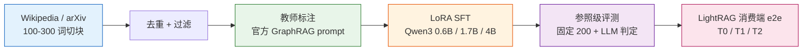
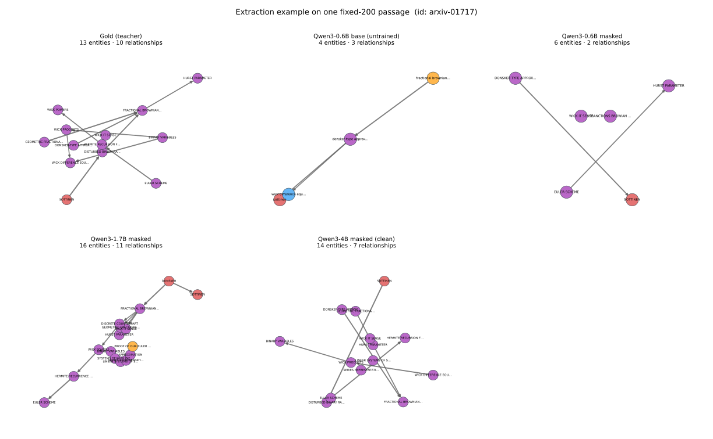

# kg-triplet-sft

[English](README.md) | **中文**


Qwen3 知识图谱抽取:数据构建 → LoRA SFT → 参照级(referent)评测 → 图 RAG 消费端验证。
用 LoRA 微调 Qwen3(0.6B / 1.7B / 4B),从开放文本中抽取 `{entities, relationships}`,
输出遵循 [Microsoft GraphRAG](https://github.com/microsoft/graphrag) 的知识模型格式;
配套一套参照级评测,以及一个 [LightRAG](https://github.com/HKUDS/LightRAG) 消费端影响研究。

本项目从复现一个开源 Qwen3-0.6B 知识图谱抽取管线出发,实测其封闭 20 关系 schema 的
结构性缺陷(数值类事实丢失、约 74% 真实语义关系无法表达)后,按"消费者 = 图谱问答"
重建为 GraphRAG 式开放抽取;自建 3349 段标注语料,微调 0.6B/1.7B/4B,自建参照级评测,
并做了消费端(LightRAG)端到端验证。

## 模型

Hugging Face 上的 LoRA adapter(canonical masked 配方):
[Qwen3-0.6B](https://huggingface.co/Alextgt/qwen3-0.6b-kg-extraction) ·
[Qwen3-1.7B](https://huggingface.co/Alextgt/qwen3-1.7b-kg-extraction) ·
[Qwen3-4B](https://huggingface.co/Alextgt/qwen3-4b-kg-extraction) ——
[合集](https://huggingface.co/collections/Alextgt/kg-triplet-sft-6aa648ecebcd524f7b55a8b7)。

## 结果速览

| 阶段 | 结果 |
|---|---|
| 语料 | 3,349 段标注(2,575 训练 / 75 验证 / 700 测试),英文 Wikipedia 60% + arXiv 40%,句边界切块(100–300 词)。 |
| 教师 | 官方 Microsoft GraphRAG 抽取 prompt(MIT),经 `qwen3-flash` 生成标签。 |
| 参照级评测 | 两级匹配(规范化标题精确 + thinking LLM 判定);固定 200 段样本(实体召回 95% CI ≈ ±2.1pt)。全量 699 段参照:实体 **R/P/F1 = 0.541 / 0.707 / 0.613**。 |
| 训练缺陷修复 | 原始"拼接文本"LoRA SFT 实为*续训损失*(prompt ≈ 答案的 10 倍,约 85–90% 梯度落在 prompt)。改用 response-only masking 后,200 段 micro-F1 由 **0.478–0.508 → 0.607**,与自建正确配方对照(0.614)持平。 |
| Base 基线 | 未微调 Qwen3-0.6B 为 micro **R/P/F1 0.159 / 0.854 / 0.268**;掩码配方达 0.536 / 0.699 / 0.607 → **SFT 净增 +0.34 F1**(非 base 泄漏)。 |
| 容量曲线 | 同配方 0.6B→4B:召回单调升,micro-F1 0.607 / 0.594 / **0.701**(4B,大小写容错解析);4B 在 schema(0.953)与幻觉(0.084)上最好。单卡 4090 成本:0.6B ≈ 1 小时,4B ≈ 4 小时。 |
| 消费端 e2e(LightRAG) | **可行性成立**;抽取质量可传导到图结构(0.6B 的图碎成 381 个连通块、最大 26,对比 4B 72、gold 136)。检索/回答质量在 **22 段**规模即饱和(原始文本已能直接作答)→ 该规模下消费端为 null,且已定位原因。 |

## 管线



## 抽取示例

同一段固定 200 样本中的文章,由教师(gold)与四个模型抽取——实体 F1 随规模上升
0.47 → 0.63 → 0.69 → **0.89**:



原文段落、各模型对照表与选例方法:**[docs/example-graph.md](docs/example-graph.md)**
(中英双语,单页)。

## 仓库结构

- `dataset/` — 语料 → 切块 → 去重/过滤 → 教师标注 → Alpaca。CLI,产物在 `dataset/data/`。
- `kg_contract/` — prompt 与契约(`graphrag_prompts.py` = 官方 GraphRAG prompt;`student_prompt.py` = 派生学生 prompt)、校验器、关系表。
- `finetune/` — LLaMA-Factory yaml、canonical masked 配方(`compshare/train_unsloth.py`)、Kaggle kernels(训练/推理,含 `kernel_capinfer/` 生成器)。
- `eval/` — 参照级评测(`referent_*.py`)、消费端轴、LightRAG e2e(`lightrag_*.py`)、示例图渲染器(`make_example_graph.py`)。入口:`eval/README.md`。
- `docs/` — ADR(0001–0009)、报告、消费端 pivot 日记、研究笔记、`docs/evidence/`(凝练证据)与 `docs/example-graph.md`。
- `.scratch/kg-triplet-round1/` — spec 与 issue(运行日志与回执)。

## 复现

依赖:Python 3.12;标注/判定需 `.env` 中的 `DASHSCOPE_API_KEY`(见 `.env.example`);
训练需 GPU(kernel 面向 Kaggle T4 与单卡 RTX 4090)。

```bash
pip install -r requirements.txt          # 数据/评测依赖;训练见各模块 README
python dataset/download.py               # → dataset/data/01_raw/
python dataset/chunk.py                  # → 02_chunks.jsonl
python dataset/filter.py                 # → corpus.jsonl(去重、配额、句边界)
# 教师标注 + 划分 + Alpaca:见 dataset/batch_infer.md 与 dataset/graphrag_batch.py
python finetune/compshare/train_unsloth.py --mask --merge ...   # canonical masked 配方(单卡 4090)
# 参照级评测 / 消费端 e2e:见 eval/README.md 与 eval/lightrag_e2e.py
# 示例图(需本地 outputs/):python eval/make_example_graph.py
```

所有数据阶段脚本都能在微型 fixture 上端到端跑通;`pytest`(126 项)覆盖数据契约、prompt 与评测胶水。

## 诚实的局限

- **原始复刻线未完成**:本仓已 pivot 到 GraphRAG 式开放抽取,原项目的 composite / `entity_f1` 是*其*报告值,此处**未复现**;spec 中的忠实复刻 review gate 从未执行。
- LightRAG 消费端研究是**案例研究**(约 22 段、16 问):无统计功效,且该规模下消费端为 **null**——当原始文本已能直接作答时,图谱不承重。
- 约 17% 的 4B 输出使用大写 schema 键,严格解析会丢弃这些行(部署需大小写容错解析器)。
- `docs/example-graph.md` 中的示例是**单个示例段落**,不是总体结果。
- `serve/`(导出/GGUF/Gradio)**未实现**。

## 决策与证据

决策见 `docs/adr/`(另见 `docs/diary/`、`docs/research/`);凝练证据见 `docs/evidence/`。

## 许可与致谢

MIT —— 见 [`LICENSE`](LICENSE) 与 [`THIRD_PARTY.md`](THIRD_PARTY.md)。训练数据不重新分发;LoRA adapter 已发布于 Hugging Face。
